# 🚀 MiniCommercial — Système de Gestion Commerciale

**MiniCommercial** est une application Web Full-Stack destinée à la gestion d'une activité commerciale.
Elle permet de gérer les **clients, produits, commandes et stocks**, ainsi que de générer et consulter les informations nécessaires à la gestion des ventes.

L'application est composée de deux parties :

* 🔹 **Back-end** : API REST développée avec ASP.NET Core .NET 8
* 🔹 **Front-end** : application Single Page Application développée avec Angular 16

## 🎥 Démonstration

[▶️ Voir la vidéo de démonstration](./screenshot/votre-video-demo.mp4)
---

## 🏗️ Architecture du projet

MiniCommercial/
├── MiniCommercial.API/          # Back-end : ASP.NET Core Web API
│   ├── Controllers/             # Endpoints REST
│   ├── Models/                  # Entités  et DTOs
│   ├── Services/                # Logique métier (Calculs, Stocks, JWT)
│   ├── Data/                    # DbContext et Migrations
│   └── Tests/                   # Tests unitaires (xUnit)
└── MiniCommercialFront/         # Front-end : Angular 16
    ├── src/app/
    │   ├── components/          # Composants UI (Dashboard, Forms, Lists)
    │   ├── services/            # Services de communication API
    │       ├── guards/              # Protection des routes (AuthGuard)
    │       └── interceptors/        # Injection auto du Token JWT
    └── environments/            # Configuration des URLs API

---

# 🛠️ Technologies utilisées

### Back-end

* **ASP.NET Core Web API**
* **.NET 8**
* **Entity Framework Core**
* **SQL Server**
* **JWT Authentication**
* **BCrypt** pour le hachage des mots de passe
* **Swagger / OpenAPI**

### Front-end

* **Angular 16**
* **TypeScript**
* **Bootstrap 5**
* **Bootstrap Icons**
* **HTML5 / CSS3**

### Base de données

* **SQL Server**
* **Entity Framework Core Migrations**

---

# 📋 Prérequis

Avant de lancer le projet, installer les outils suivants.

### 1. .NET 8 SDK

Télécharger et installer le **.NET 8 SDK** :

https://dotnet.microsoft.com/download/dotnet/8.0

Vérifier l'installation :

```bash
dotnet --version
```

La version doit être **8.x.x**.

---

### 2. Node.js

Installer **Node.js 18 ou une version compatible avec Angular 16** :

https://nodejs.org/

Vérifier l'installation :

```bash
node --version
npm --version
```

---

### 3. Angular CLI

Installer Angular CLI :

```bash
npm install -g @angular/cli@16
```

Vérifier la version :

```bash
ng version
```

---

### 4. SQL Server

Le projet utilise SQL Server.

Vous pouvez utiliser :

* SQL Server Express
* SQL Server Developer
* SQL Server LocalDB

Téléchargement :

https://www.microsoft.com/en-us/sql-server/sql-server-downloads

---

### 5. Entity Framework Core CLI

Installer l'outil EF Core si nécessaire :

```bash
dotnet tool install --global dotnet-ef
```

Vérifier :

```bash
dotnet ef --version
```

---

# ⚙️ Installation et lancement du Back-end

## 1. Cloner le projet

```bash
git clone https://github.com/maGNICHI/MiniCommercial.git
cd MiniCommercial
```

---

## 2. Accéder au projet Back-end

```bash
cd MiniCommercial.API
```

> Si le nom du dossier est différent dans le projet, utiliser le chemin correspondant au dossier contenant le fichier `.csproj`.

---

## 3. Configurer la base de données

Ouvrir le fichier :

```text
MiniCommercial.API/appsettings.json
```

Configurer la chaîne de connexion SQL Server.

### Exemple avec LocalDB

```json
{
  "ConnectionStrings": {
    "DefaultConnection": "Server=(localdb)\\MSSQLLocalDB;Database=MiniCommercialDB;Trusted_Connection=True;TrustServerCertificate=True;"
  }
}
```

### Exemple avec SQL Server Express

```json
{
  "ConnectionStrings": {
    "DefaultConnection": "Server=.\\SQLEXPRESS;Database=MiniCommercialDB;Trusted_Connection=True;TrustServerCertificate=True;"
  }
}
```

Adapter la chaîne de connexion selon l'installation SQL Server utilisée.

---

## 4. Restaurer les dépendances

Depuis le dossier du Back-end :

```bash
dotnet restore
```

---

## 5. Appliquer les migrations

Créer ou mettre à jour la base de données :

```bash
dotnet ef database update
```

Cette commande permet d'appliquer les migrations Entity Framework Core et de créer automatiquement la base :

```text
MiniCommercialDB
```

---

## 6. Lancer l'API

```bash
dotnet run
```

L'API sera accessible sur l'URL indiquée dans la console.

Par exemple :

```text
https://localhost:7121
```

---

# 📚 Swagger / OpenAPI

Swagger permet de tester directement les endpoints de l'API sans utiliser le front-end.

Une fois le Back-end lancé, ouvrir :

```text
https://localhost:7121/swagger
```

> Le port peut être différent selon la configuration du projet. Utiliser l'URL affichée dans la console après `dotnet run`.

## Exemples d'API disponibles

### 👤 Clients

* `GET /api/clients`
* `GET /api/clients/{id}`
* `POST /api/clients`
* `PUT /api/clients/{id}`
* `DELETE /api/clients/{id}`

### 📦 Produits

* `GET /api/products`
* `GET /api/products/{id}`
* `POST /api/products`
* `PUT /api/products/{id}`
* `DELETE /api/products/{id}`

### 🛒 Commandes

* `GET /api/commandes`
* `GET /api/commandes/{id}`
* `POST /api/commandes`
* `PUT /api/commandes/{id}`

---

# 🔐 Authentification

L'application utilise **JWT (JSON Web Token)** pour sécuriser l'accès aux fonctionnalités protégées de l'API.

Le principe d'authentification est le suivant :

```text
Utilisateur
    │
    ▼
Login
    │
    ▼
API
    │
    ▼
Validation des identifiants
    │
    ▼
Génération du JWT
    │
    ▼
Token envoyé au Front-end
    │
    ▼
Token utilisé pour accéder aux endpoints protégés
```

Pour les endpoints nécessitant une authentification, utiliser le bouton :

```text
Authorize
```

dans Swagger, puis renseigner le token JWT selon le format attendu par l'API :

```text
Bearer <JWT_TOKEN>
```
---

## 🔐 Sécurité et Accès Restreint

**L'intégralité de l'application est sécurisée.** 

Pour respecter les exigences de confidentialité des données commerciales, aucun accès n'est autorisé sans une authentification préalable :

*   **Côté Front-end (Angular) :** Toutes les routes (`/dashboard`, `/clients`, `/products`, `/orders`) sont protégées par un **AuthGuard**. Si un utilisateur tente d'accéder à une page sans être connecté, il est automatiquement redirigé vers la page de Connexion.
*   **Côté Back-end (.NET 8) :** Tous les points d'accès (Endpoints) de l'API sont verrouillés avec l'attribut `[Authorize]`. Seules les requêtes contenant un **Token JWT valide** dans le header sont acceptées.
*   **Première utilisation :** Lors du premier lancement, vous devez impérativement passer par la page **Inscription** (`/register`) pour créer votre compte administrateur afin de pouvoir explorer l'application.

---

# 🌐 Installation et lancement du Front-end

## 1. Ouvrir un nouveau terminal

Il est recommandé de laisser le Back-end tourner dans le premier terminal.

Dans un deuxième terminal, accéder au dossier Angular :

```bash
cd MiniCommercialFront
```

---

## 2. Installer les dépendances

```bash
npm install
```

---

## 3. Vérifier l'URL de l'API

Selon la configuration du projet, vérifier les fichiers d'environnement Angular, par exemple :

```text
src/environments/environment.ts
```

Exemple :

```typescript
export const environment = {
  production: false,
  apiUrl: 'https://localhost:7121/api'
};
```

Adapter `apiUrl` à l'adresse utilisée par le Back-end.

---

## 4. Lancer Angular

```bash
ng serve
```

Ou :

```bash
ng serve --open
```

L'application sera accessible à :

```text
http://localhost:4200
```

---

# 🔑 Informations de connexion

Si aucun compte de test n'est fourni, créer d'abord un compte via l'interface d'inscription ou l'endpoint d'authentification prévu par l'application.
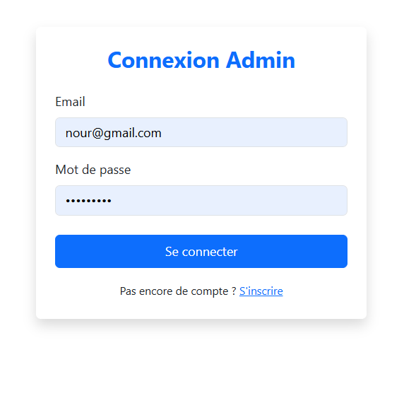
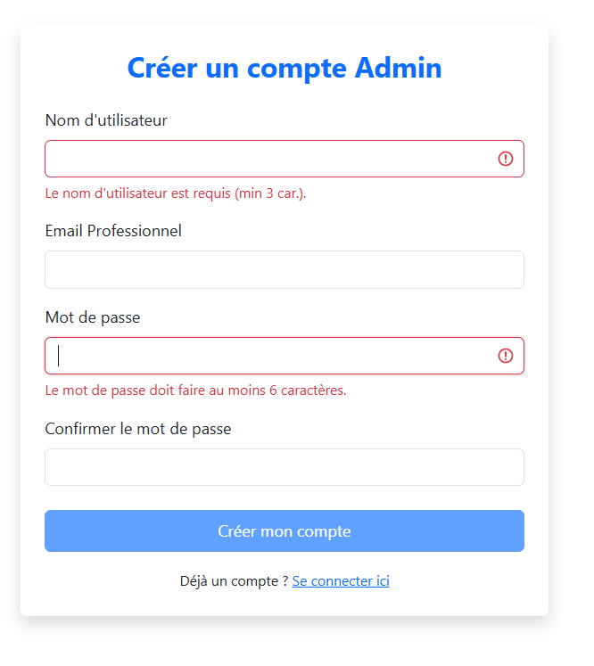

---

# 📊 Fonctionnalités principales

## 👥 Gestion des clients
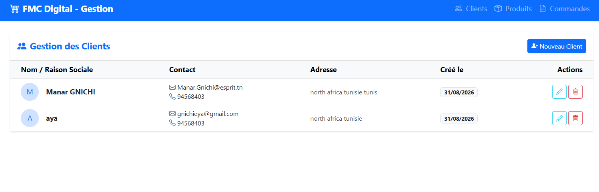

### Capture — Création d'un client
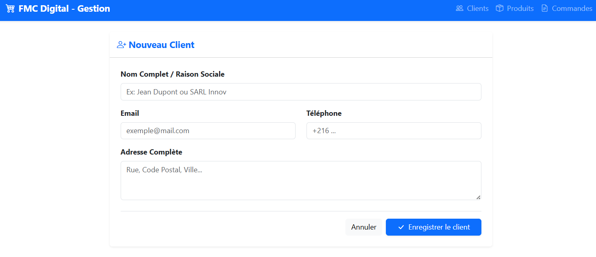

---

# 📦 Gestion des produits
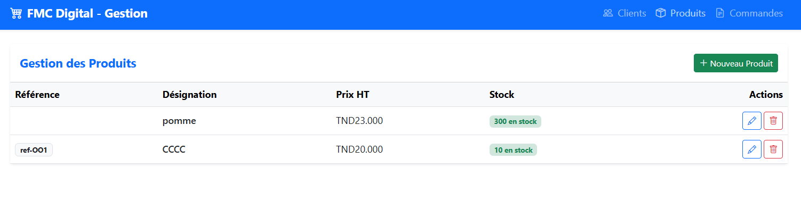

### Capture — Modification d'un produit
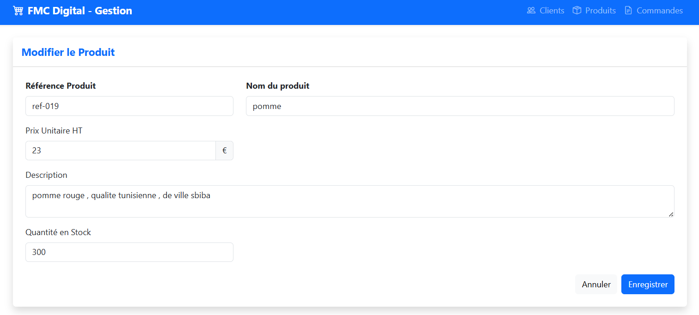

---

# 🛒 Gestion des commandes
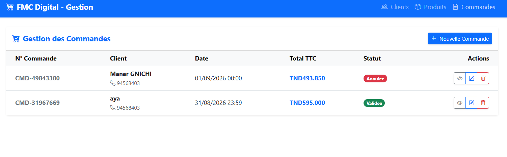

### Capture — Détail d'une commande
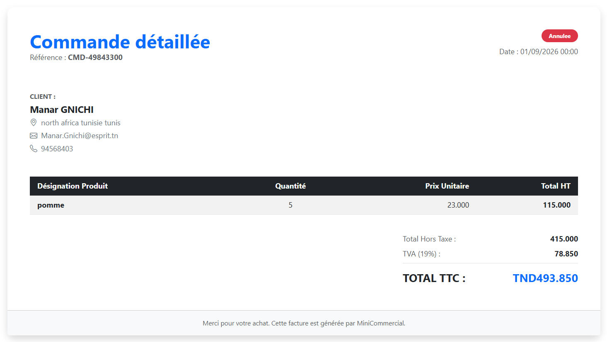

# 📦 Dashboard


---

# 🧪 Tests de l'API avec Swagger

## 👤 GET — Liste des clients
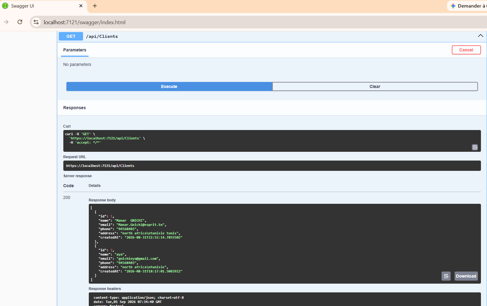

## 👤 POST — Ajouter un client
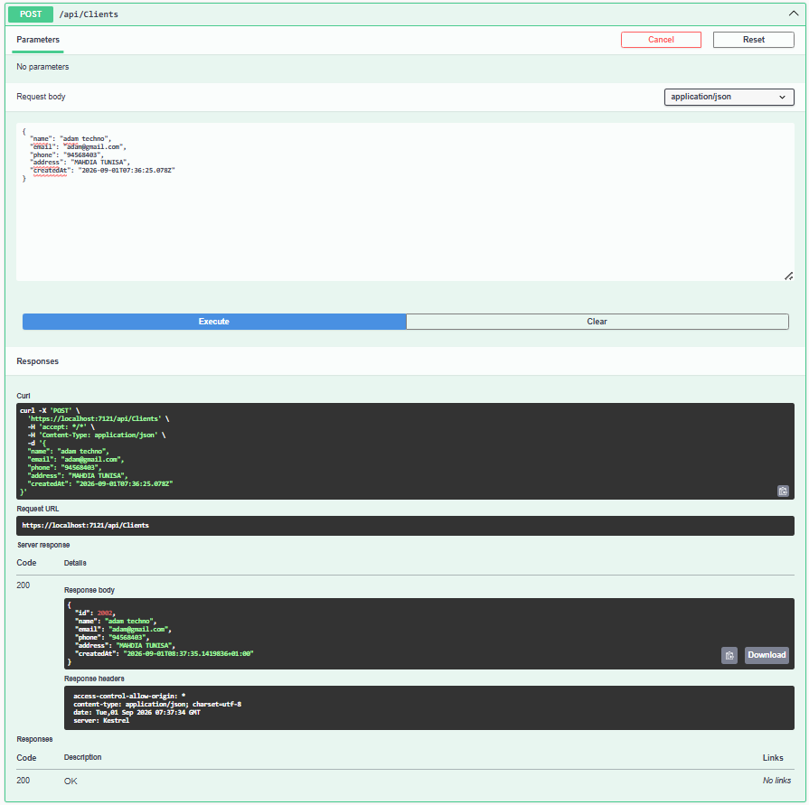

## 👤 PUT — Modifier un client
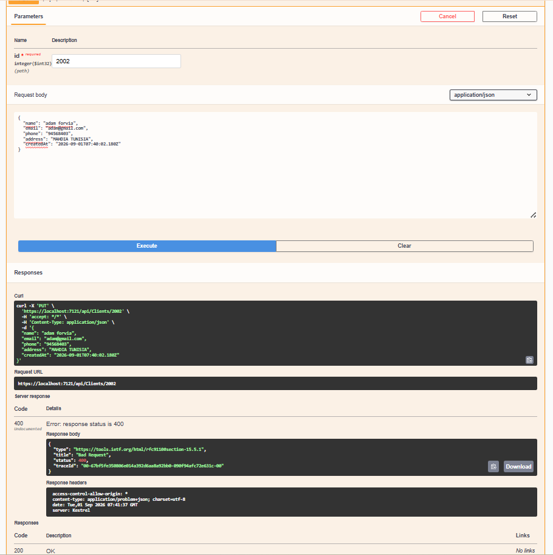

## 👤 GET — Client par ID
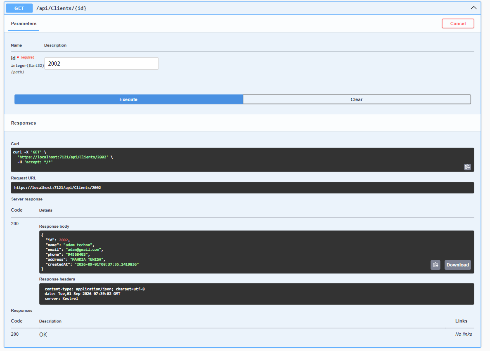

## 📦 GET — Liste des produits
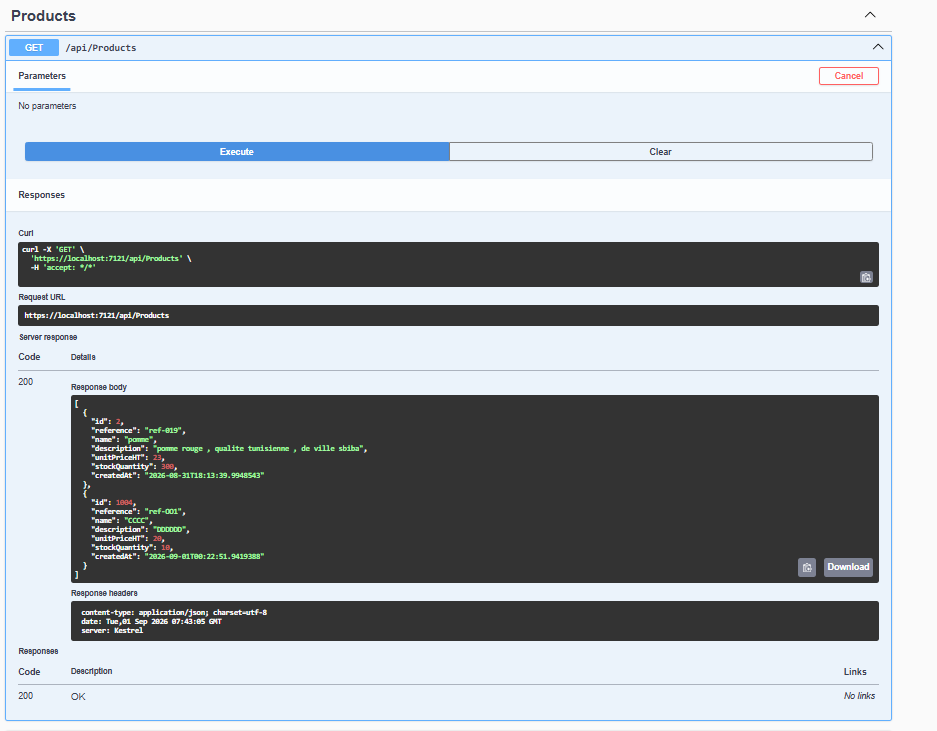

## 📦 DELETE — Supprimer un produit
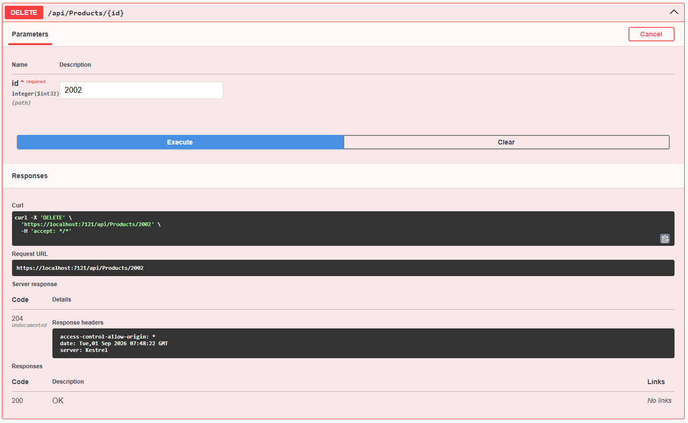

## 🛒 GET — Liste des commandes
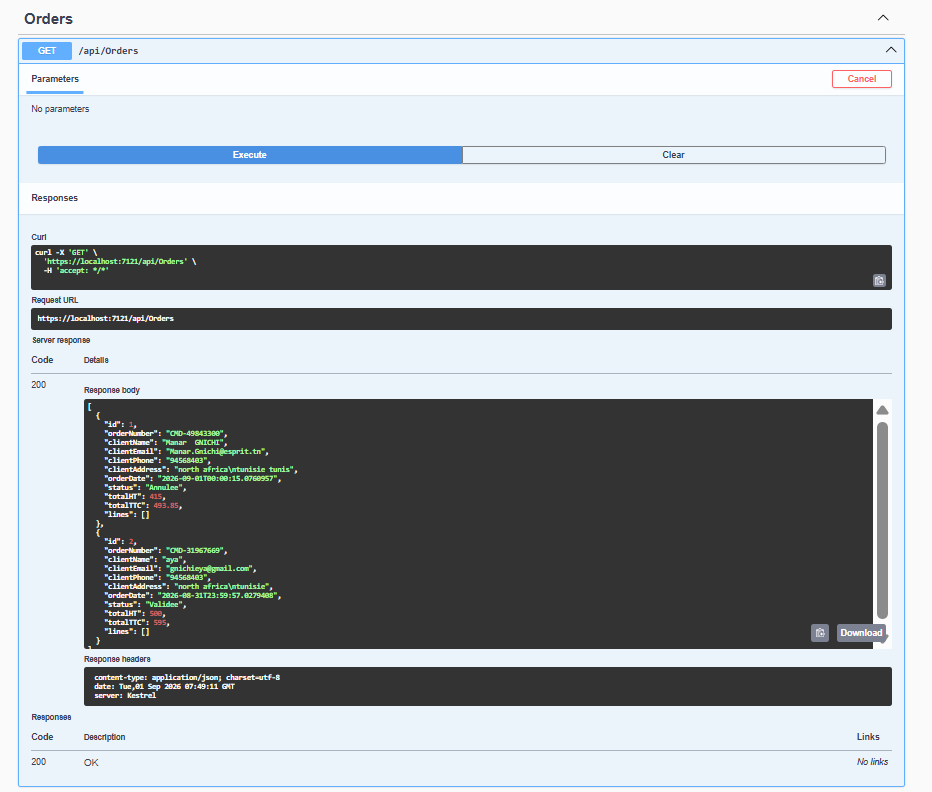

## 🛒 GET — Commande par ID
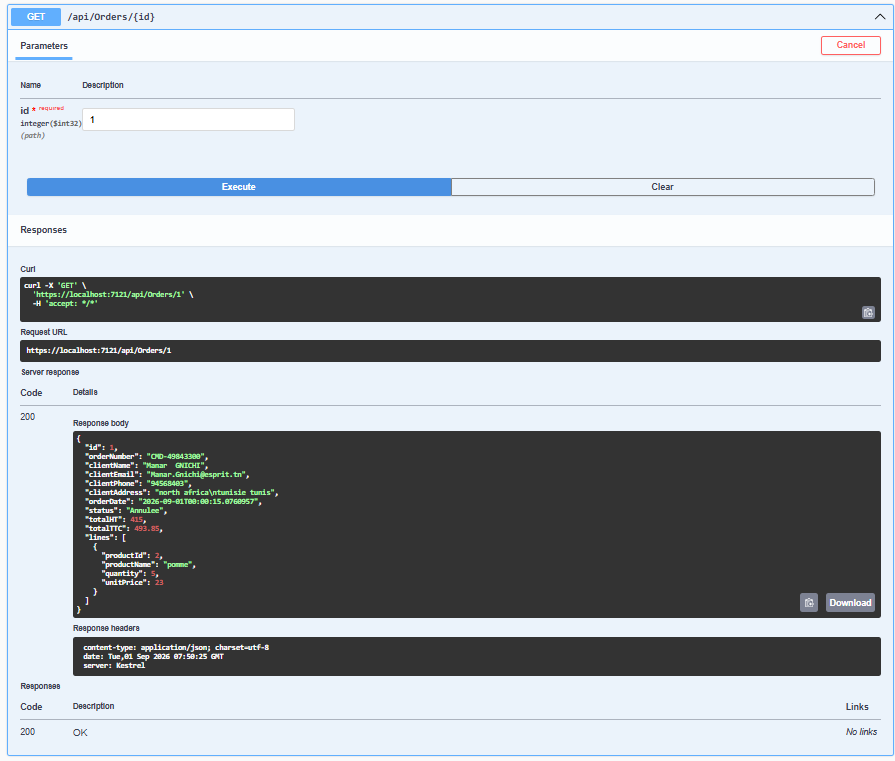
---

# 🔄 Démarrage rapide

Pour lancer le projet en local :

### Terminal 1 — Back-end

```bash
cd MiniCommercial.API
dotnet restore
dotnet ef database update
dotnet run
```

### Terminal 2 — Front-end

```bash
cd MiniCommercialFront
npm install
ng serve --open
```

Puis ouvrir :

```text
http://localhost:4200
```

Pour tester l'API :

```text
https://localhost:7121/swagger
```

---

# 🧩 Résumé des technologies

| Partie                    | Technologie           |
| ------------------------- | --------------------- |
| Front-end                 | Angular 16            |
| UI                        | Bootstrap 5           |
| Back-end                  | ASP.NET Core .NET 8   |
| API                       | REST                  |
| ORM                       | Entity Framework Core |
| Base de données           | SQL Server            |
| Authentification          | JWT                   |
| Hashage des mots de passe | BCrypt                |
| Documentation API         | Swagger / OpenAPI     |
| Langage Front-end         | TypeScript            |
| Langage Back-end          | C#                    |


---

## 🧪 Tests Unitaires & Qualité du Code

Afin de garantir la fiabilité des calculs financiers et le respect des règles métier (notamment la gestion critique des stocks), une suite de tests unitaires automatisés a été mise en place côté Back-end en utilisant **xUnit** et **Entity Framework InMemory**.

### ✅ Scénarios de tests couverts :
*   **Calcul de la TVA (19%) :** Vérification que le Total TTC est correctement calculé à partir du HT.
*   **Gestion du Stock :** Validation de la diminution automatique des stocks lors de la validation d'une commande.
*   **Sécurité métier :** Vérification du blocage d'une commande si la quantité demandée dépasse le stock disponible.
*   **Sécurité Authentification :** Test du bon hachage et de la vérification des mots de passe via **BCrypt**.
*   **Dashboard :** Validation de l'exactitude des sommes globales (Chiffre d'affaires) pour les statistiques.

### 🚀 Exécution des tests :
Pour lancer la suite de tests et vérifier l'intégrité de l'application, exécutez la commande suivante à la racine du projet :

```bash
dotnet test MiniCommercial.Tests/MiniCommercial.Tests.csproj


---
[Résultat des Tests](./screenshot/TEST.png)`
# 👩‍💻 Auteur

**Manar Gnichi**

Projet réalisé dans le cadre d'un mini-projet Full-Stack de gestion commerciale.

---

# 📌 Remarque

Pour exécuter correctement l'application, le **Back-end ASP.NET Core doit être lancé avant le Front-end Angular**, car Angular communique avec l'API REST pour récupérer et modifier les données.

L'application est conçue pour fonctionner en environnement local avec **Angular 16, .NET 8 et SQL Server**.
